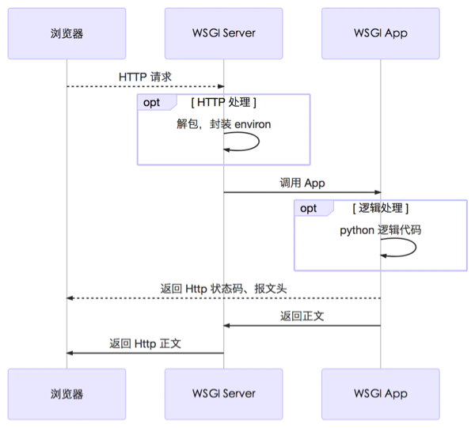

# WSGI
> Python Web Server Gateway Interface，指定了web服务器和Python web应用或web框架之间的标准接口，以提高web应用在一系列web服务器间的移植性

1. WSGI是一套接口标准协议/规范；
2. 通信（作用）区间是Web服务器和Python Web应用程序之间；
3. 目的是制定标准，以保证不同Web服务器可以和不同的Python程序之间相互通信

* flask -  werkzeug 创建WSGI服务器

* Django - wsgiref 创建WSGI服务器




## WSGI的标准或规范是 

1. web服务器在将请求转交给web应用程序之前，需要先将http报文转换为WSGI规定的格式。

2. WSGI规定，Web程序必须有一个可调用对象，且该可调用对象接收两个参数，返回一个可迭代对象：

    * environ：字典，包含请求的所有信息
    * start_response：在可调用对象中调用的函数，用来发起响应，参数包括状态码，headers等


## wsgiref

使用wsgiref创建一个简单的WSGI服务器

```python
from wsgiref.simple_server import make_server

def hello(environ, start_response):
    status = "200 OK"
    response_headers = [('Content-Type', 'text/html')]
    start_response(status, response_headers)
    path = environ['PATH_INFO'][1:] or 'hello'
    return [b'<h1> %s </h1>' % path.encode()]

if __name__ == '__main__':
    server = make_server('localhost', 8001, hello)
    print('Serving HTTP on port 8001...')
    server.serve_forever()
```

1. 创建一个符合WSGI标准的一个HTTP处理函数 `hello`, TA接收两个参数：
    * environ：一个包含所有HTTP请求信息的dict对象；
    * start_response：一个发送HTTP响应的函数

2. 在处理函数`hello`中，调用`start_response('200 OK', [('Content-Type', 'text/html')])`
   发送了HTTP响应的Header，注意Header只能发送一次，也就是只能调用一次start_response()函数  

3. 添加函数的返回值 `<h1>Hello, web!</h1>`, 将作为HTTP响应的Body发送给浏览器

4. HTTP处理函数`hello` 必须由WSGI服务器来调用, 使用`wsgiref.simple_server.make_server('localhost', 8001, hello)`加载函数
  > Python内置了一个WSGI服务器，这个模块叫wsgiref
5. 启动启动WSGI服务器`server.serve_forever`


## werkzeug

使用wsgiref创建一个简单的WSGI服务器

```python
from werkzeug.serving import run_simple

def hello(environ, start_response):
    start_response('200 OK', [('Content-Type', 'text/html')])
    path = environ['PATH_INFO'][1:] or 'hello'
    return [b'<h1> %s </h1>' % path.encode()]

# @Request.application
# def hello(request):
#     return Response('Hello World')

if __name__ == '__main__':
    run_simple('localhost', 5001, hello)
```

创建过程同 wsgiref ，不同的是可以使用`@Request.application`来装饰一个wsgi应用


