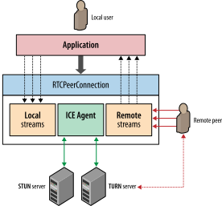

## WebRTC

> Web Real-Time Communications (WebRTC) is a specification for a protocol implementation that enables web apps to transmit video, audio and data streams between client (typically a web browser) and server (usually a web server).

> Web实时通信(WebRTC)是一种协议实现规范，使Web应用程序能够在客户端(通常是Web浏览器)和服务器(通常是Web服务器)之间传输视频、音频和数据流。

webrtc标准和开发
 * Web Real-Time Communications (WEBRTC) W3C Working Group是负责定义浏览器接口部分标准的组织
 * Real-Time Communication in Web-browsers (RTCWEB) 是 IETF 工作组，负责定义协议，数据格式，安全，以及一切技术底层。
webrtc具有很强的扩展性，容易跟其他现有的音视频通讯系统结合。符合现在网速的爆发性增长，很有前瞻性。

### 音视频引擎
 1. 在发送端，问题点在于应对不断波动的带宽和延迟，对音视频流进行处理。
 2. 在接收端，必须实时解码流，并能够适应网络抖动和延迟延迟


### 音视频获取及处理
媒体捕获和流W3C规范定义了一组新的JavaScript API，使应用程序能够从平台请求音频和视频流，以及一组API来处理和处理所获取的媒体流


#### WebRTC 的JavaScript标准
>[参考:JavaScript 标准参考教程（alpha）》，by 阮一峰](https://javascript.ruanyifeng.com/htmlapi/webrtc.html)

WebRTC主要让浏览器具备三个作用。

 * 获取音频和视频
 * 进行音频和视频通信
 * 进行任意数据的通信

WebRTC共分成三个API，分别对应上面三个作用。

 * MediaStream （又称getUserMedia）
 * RTCPeerConnection
 * RTCDataChannel

1. navigator.getUserMedia方法用于，在浏览器中获取音频（通过麦克风）和视频（通过摄像头）

    ```javascript
    // ------ 获取视频流
    var constraints = {video: true, audio: true};
    function onSuccess(stream) {
      var video = document.querySelector("video");
      video.src = window.URL.createObjectURL(stream);
    }
    function onError(error) {
      console.log("navigator.getUserMedia error: ", error);
    }
    navigator.getUserMedia(constraints, onSuccess, onError);
    ```

2. RTCPeerConnection的作用是在浏览器之间建立数据的“点对点”（peer to peer）通信
   > 不同客户端之间的音频/视频传递，是不用通过服务器的。但是，两个客户端之间建立联系，需要通过服务器。服务器主要转递两种数据。
   > 1. 通信内容的元数据：打开/关闭对话（session）的命令、媒体文件的元数据（编码格式、媒体类型和带宽）等。
   > 2. 网络通信的元数据：IP地址、NAT网络地址翻译和防火墙等

    ```javascript
    var pc;
    var configuration = {};
    // run start(true) to initiate a call
    function start(isCaller) {
        pc = new RTCPeerConnection(configuration);
    
        pc.onicecandidate = function (evt) {
            // TODO send any ice candidates to the other peer
        };
    
        // once remote stream arrives, show it in the remote video element
        pc.onaddstream = function (evt) {
            remoteView.src = URL.createObjectURL(evt.stream);
        };
    
        // get the local stream, show it in the local video element and send it
        navigator.getUserMedia({ "audio": true, "video": true }, function (stream) {
            selfView.src = URL.createObjectURL(stream);
            pc.addStream(stream);
    
            if (isCaller)
                pc.createOffer(gotDescription);
            else
                pc.createAnswer(pc.remoteDescription, gotDescription);
    
            function gotDescription(desc) {
                pc.setLocalDescription(desc);
                // TODO send adp data to the other peer through signal server
            }
        });
    }
    
    var onSignalMessage = function (evt) {
        // TODO receve message from signal server
        if (!pc)
            start(false); 
        var signal = JSON.parse(evt.data);
        if (signal.sdp)
            pc.setRemoteDescription(new RTCSessionDescription(signal.sdp));
        else
            pc.addIceCandidate(new RTCIceCandidate(signal.candidate));
    };
    ```

3. RTCDataChannel的作用是在点对点之间，传播任意数据。它的API与WebSockets的API相同

    ```javascript
    var pc = new webkitRTCPeerConnection(servers, {optional: [{RtpDataChannels: true}]});

    pc.ondatachannel = function(event) {
        receiveChannel = event.channel;
        receiveChannel.onmessage = function(event){
            document.querySelector("div#receive").innerHTML = event.data;
        };
    };
    
    sendChannel = pc.createDataChannel("sendDataChannel", {reliable: false});
    
    document.querySelector("button#send").onclick = function (){
        var data = document.querySelector("textarea#send").value;
        sendChannel.send(data);
    };
    ```

### 实时网络传输

音视频流应该可以容忍间歇性的分组丢失：音频和视频编解码器可以填充小的虚假数据，通常对输出质量影响极小。
另外，应用程序可以传送额外的数据来恢复丢失或延迟的数据包，但是及时性和低延迟比可靠性更重要。 
由于实时性的需要选择udp。


ICE、STUN和TURN是通过UDP建立并维护端到端连接所必需的；
SDP 是一种数据格式，用于端到端连接时协商参数；
DTLS用于保障传输数据的安全；
SCTP和SRTP属于应用层协议，用于在UDP之上提供不同流的多路复用、拥塞和流量控制，以及部分可靠的交付和其他服务。

ICE（Interactive Connectivity Establishment，交互连接建立）：由于端与端之间存在多层防火墙和NAT设备阻隔，因此我们需要一种机制来收集两端之间公共线路的IP，而ICE则是干这件事的好帮手。

   1. ICE代理: 每个RTCPeerConnection都包含一个ICE agent，负责收集本地ip，port对；负责进行peer间的连接检查；负责发送keepalives 
   2. 如果配置了STUN服务器，ICE代理会查询外部STUN服务器，以取得本地端的公共IP和端口
   3. 如果配置了TURN服务器，ICE则会将TURN服务器作为一个候选项，当端到端的连接失败，数据将通过指定的中间设备转发。

#### 实时端连接 RTCPeerConnection



#### 建立Peer-to-Peer连接
通知（信令）和初始会话协商的交付留给应用程序


iceGatheringState有3个状态：

 * new 刚创建，还没网络信息
 * gathering 正在获取本地candidates
 * complete 已经完成所有candidates获取

iceConnectionState 有7个状态：

* new 正在获取本地candidates，也在等待对端的candidates
* checking 正在尝试连接，起码收到一个对端的candidate，但同时可能还在获取candidates中
* connected 已经找到一个连接是有效的，但还在尝试其他的。
* completed 已经确定一个将用来使用的连接。
* failed 所有candidate都尝试过都失败，可能试试turn？
* disconnected 心跳包失败？可能自己内部解决。
* closed 表示 ICE agent关闭


由于p2p的不可靠天性，连接过程中重连可能经常出现。即使已经连上了，ICE agent也有可能周期性的检查网络，寻找跟好的网络连接替代品。

谷歌有个webrtc的跟踪工具 chrome://webrtc-internals


## 一对一

两个 WebRTC Peer 之间是如何建立一对一通话链路的


在一对一通话场景中，每个 Client 均创建有一个 PeerConnection 对象，
由一方主动发 OFFER SDP，
另一方则应答 ANSWER SDP，
最后双方交换 ICE Candidate 从而完成通话链路的建立


## 一对多


## 多对多


## Reference 

* [webrtc](https://www.fullstackpython.com/webrtc.html)
* [webrtc详解](https://blog.csdn.net/tifentan/article/details/77941236)